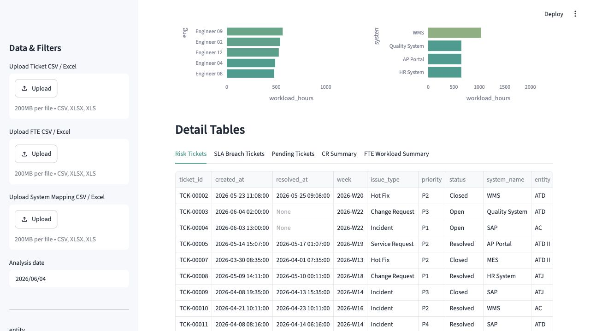
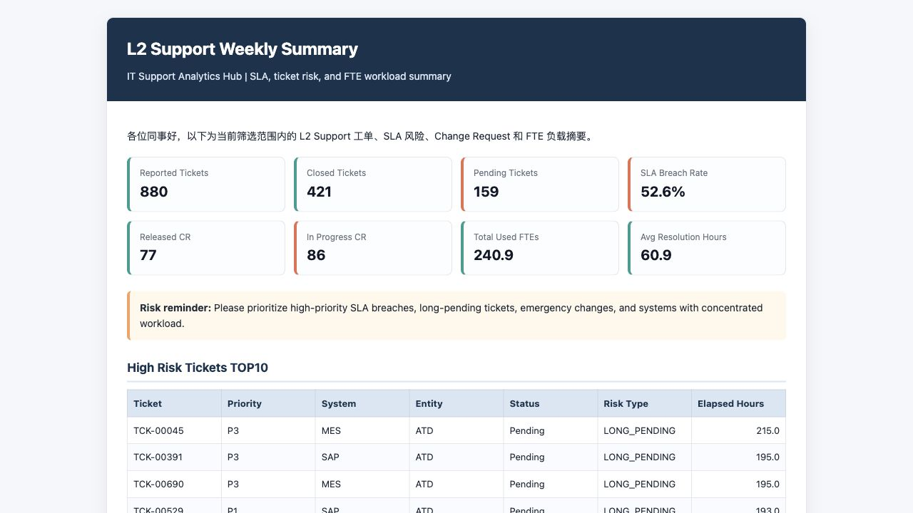

# IT Support Analytics Hub

企业 IT 运维工单与 SLA 分析平台

IT Support Analytics Hub is a Streamlit-based office productivity demo that simulates weekly L2 Support Report automation using Jira-style ticket data and FTE workload data.

🚀 Live Demo: https://it-support-analytics-app-ewmfht5mzlvkmcsrphkshv.streamlit.app/

> This project uses simulated data only. It does not contain any real company, employee, customer, email, system URL, or confidential operational information.

## Project Background

This project is based on an enterprise IT operations internship scenario. It simulates how an IT support team exports Jira tickets, cleans Excel data, monitors SLA risks, analyzes FTE workload, and prepares a weekly L2 Support Report. The goal is to productize a repetitive reporting workflow into a lightweight analytics tool.

## Core Features

- Load default sample data or upload Ticket, FTE, and System Mapping files.
- Validate required fields for CSV, XLSX, and XLS uploads.
- Apply P1/P2/P3/P4 SLA rules and detect SLA breaches.
- Identify long-pending tickets and in-progress Change Requests.
- Analyze engineer workload and high-load systems.
- Visualize ticket trends, status distribution, SLA breach hotspots, pending tickets, and FTE workload.
- Export Excel Weekly Support Report, HTML Weekly Summary, and Risk Ticket List CSV.

## Business Rules

| Rule Area | Logic | Output |
| --- | --- | --- |
| P1 SLA | Target resolution within 8 hours | SLA breach if elapsed hours > 8 |
| P2 SLA | Target resolution within 24 hours | SLA breach if elapsed hours > 24 |
| P3 SLA | Target resolution within 72 hours | SLA breach if elapsed hours > 72 |
| P4 SLA | Target resolution within 120 hours | SLA breach if elapsed hours > 120 |
| Long Pending | `status == Pending` and elapsed hours > 72 | `LONG_PENDING` |
| Change Request released | CR status is Resolved or Closed | `Released CR` |
| Change Request in progress | CR status is Open, In Progress, or Pending | `In Progress CR` |
| Engineer high load | Weekly engineer workload > 45 hours | `HIGH_LOAD` |
| System high load | Weekly system workload > 120 hours | `HIGH_SYSTEM_LOAD` |
| High risk | P1 SLA breach, long pending > 120 hours, or pending emergency change | `HIGH` |
| Medium risk | P2/P3 SLA breach, long pending, or in-progress CR | `MEDIUM` |

## Tech Stack

- Python
- Pandas
- Streamlit
- Plotly
- openpyxl
- xlsxwriter

## Project Structure

```text
it-support-analytics-hub/
├── app.py
├── requirements.txt
├── README.md
├── .gitignore
├── data/
│   ├── sample_tickets.csv
│   ├── sample_fte.csv
│   └── sample_system_mapping.csv
├── src/
│   ├── __init__.py
│   ├── data_generator.py
│   ├── data_loader.py
│   ├── sla_rules.py
│   ├── metrics.py
│   ├── report_generator.py
│   └── utils.py
├── outputs/
│   └── .gitkeep
└── assets/
    └── .gitkeep
```

## Local Setup

```bash
pip install -r requirements.txt
streamlit run app.py
```

Regenerate sample data if needed:

```bash
python src/data_generator.py
```

## Sample Data

The `data/` folder contains simulated datasets:

- `sample_tickets.csv`: at least 800 Jira-style ticket records across 12 weeks.
- `sample_fte.csv`: at least 300 weekly workload records by system, entity, and engineer.
- `sample_system_mapping.csv`: 8 system mapping records with fictional owners, business domains, criticality, and support level.

The sample data intentionally includes open, in-progress, pending, resolved, closed, SLA-breached, long-pending, change request, high-engineer-load, and high-system-load cases.

## Dashboard Preview



## HTML Weekly Summary Preview



## Resume Description

中文简历版：

> IT Support Analytics Hub｜企业 IT 运维工单与 SLA 分析平台｜个人项目  
> 基于企业 IT 团队 L2 Support Report 场景，自主开发 Streamlit 数据分析工具；使用 Python/Pandas 处理模拟 Jira 工单、FTE 工时和系统 Mapping 数据，固化 P1/P2/P3/P4 SLA、Long Pending、Change Request 状态分类和工程师/系统高负载识别规则；支持 KPI 看板、Plotly 可视化、风险工单明细、Excel 周报、HTML 周报摘要和风险工单 CSV 导出，模拟提升 IT 运维周报和 SLA 监控效率。

English resume version:

> Built IT Support Analytics Hub, a Streamlit-based L2 support analytics tool using Python, Pandas, and Plotly. Implemented CSV/Excel uploads, required-field validation, Jira-style ticket SLA rules, long-pending detection, Change Request status classification, FTE workload analysis, KPI dashboards, Plotly visualizations, Excel weekly report export, HTML weekly summary generation, and risk-ticket CSV export with fully simulated enterprise IT support data.

## Roadmap

- Jira API integration.
- Automated weekly email report.
- LLM-generated risk summary and follow-up wording.
- Database storage for historical weekly reports.
- User permissions by entity, system, or support role.
- Deployment to Streamlit Cloud.

## Scope Notes

This MVP intentionally does not implement user login, database storage, real Jira API integration, real email sending, LLM APIs, LangChain, LangGraph, or complex backend services.
