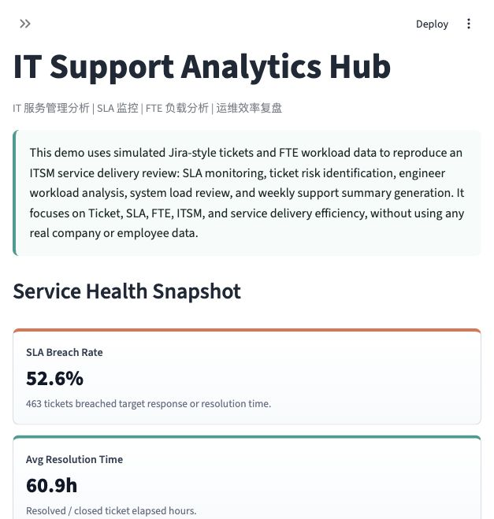

# IT Support Analytics Hub

企业 IT 服务管理与 SLA 分析平台  
ITSM Analytics / SLA Monitoring / FTE Workload Analysis / Service Delivery Review

Live Demo: https://it-support-analytics-app-ewmfht5mzlvkmcsrphkshv.streamlit.app/

IT Support Analytics Hub 是一个基于模拟 Jira 工单和 FTE 工时数据的 IT 服务管理分析工具。它不和 PMO 项目抢“项目组合管理”定位，而是聚焦 Ticket、SLA、FTE、系统故障分布和服务响应效率，用于复盘 IT Support / L2 Support 的服务交付质量。

> This project uses simulated data only. It does not contain any real company, employee, customer, email, system URL, or confidential operational information.

## 项目定位

| 维度 | 定位 |
| --- | --- |
| 核心场景 | Jira 工单、SLA breach、FTE 工时、系统负载、L2 Support 周报 |
| 能力证明 | Jira 工单分析、SLA 指标体系、FTE 负载分析、系统故障分布、服务响应效率分析、运维管理看板 |
| 适配岗位 | 数据分析、IT PMO、数据产品、B 端产品运营、业务分析 |
| 关键词 | SLA、FTE、Ticket、ITSM、运维分析、服务交付效率 |

## Project Background

企业 IT 支持团队通常需要定期导出 Jira 或 ITSM 工单，统计 P1/P2/P3/P4 处理情况，判断 SLA 是否超时，分析 Pending / In Progress / Resolved 工单，复盘工程师负载和系统负载，并整理周度 Support Report。本项目将这类周报分析流程产品化为一个可运行的 Streamlit MVP。

## ITSM Service Delivery Analytics Workflow

```text
Jira-style Tickets + FTE Workload + System Mapping
        ↓
Data Validation and Cleaning
        ↓
SLA Rule Calculation
        ↓
Ticket Risk and Long Pending Detection
        ↓
Engineer / System Workload Review
        ↓
Weekly Support Report Export
```

| Step | Workflow | Output |
| --- | --- | --- |
| Step 1 | Load Jira Tickets | 导入 Ticket、FTE 和系统 Mapping 数据 |
| Step 2 | Monitor SLA | 按 P1/P2/P3/P4 目标时长识别 SLA breach |
| Step 3 | Review Workload | 分析工程师工时、系统负载和高负载系统 |
| Step 4 | Analyze Delivery | 按 entity、system、priority、status 复盘服务效率 |
| Step 5 | Export Support Pack | 导出 Excel 周报、HTML Summary 和风险工单 CSV |

## Core Features

- Load default sample data or upload Ticket, FTE, and System Mapping files.
- Validate required fields for CSV, XLSX, and XLS uploads.
- Apply P1/P2/P3/P4 SLA rules and detect SLA breaches.
- Identify long-pending tickets and in-progress Change Requests.
- Analyze engineer workload, system workload, high-load engineers, and high-load systems.
- Visualize ticket trends, status distribution, SLA breach hotspots, pending tickets, and FTE workload.
- Export Excel Weekly Support Report, HTML Weekly Summary, and Risk Ticket List CSV.

## Business Rules

| Rule Area | Logic | Output |
| --- | --- | --- |
| P1 SLA | Target resolution within 8 hours | SLA breach if elapsed hours > 8 |
| P2 SLA | Target resolution within 24 hours | SLA breach if elapsed hours > 24 |
| P3 SLA | Target resolution within 72 hours | SLA breach if elapsed hours > 72 |
| P4 SLA | Target resolution within 120 hours | SLA breach if elapsed hours > 120 |
| Long Pending | `status == Pending` and elapsed hours > 72 | `LONG_PENDING` |
| Change Request released | CR status is Resolved or Closed | `Released CR` |
| Change Request in progress | CR status is Open, In Progress, or Pending | `In Progress CR` |
| Engineer high load | Weekly engineer workload > 45 hours | `HIGH_LOAD` |
| System high load | Weekly system workload > 120 hours | `HIGH_SYSTEM_LOAD` |
| High risk | P1 SLA breach, long pending > 120 hours, or pending emergency change | `HIGH` |
| Medium risk | P2/P3 SLA breach, long pending, or in-progress CR | `MEDIUM` |

## Service Health Console Preview

首屏截图应展示 `Service Health Snapshot → SLA Breach Analysis → Workload Heatmap → Ticket Flow / SLA Funnel → Engineer Workload Board`，突出 IT 服务交付效率分析台。



截图位置：`assets/service_health_console.png`

## HTML Weekly Summary Preview


## Tech Stack

- Python
- Pandas
- Streamlit
- Plotly
- openpyxl
- xlsxwriter

## Project Structure

```text
it-support-analytics-hub/
├── app.py
├── requirements.txt
├── README.md
├── data/
│   ├── sample_tickets.csv
│   ├── sample_fte.csv
│   └── sample_system_mapping.csv
├── src/
│   ├── data_generator.py
│   ├── data_loader.py
│   ├── sla_rules.py
│   ├── metrics.py
│   ├── report_generator.py
│   └── utils.py
└── outputs/
```

## Local Setup

```bash
pip install -r requirements.txt
streamlit run app.py
```

Regenerate sample data if needed:

```bash
python src/data_generator.py
```

## Sample Data

- `sample_tickets.csv`: Jira-style ticket records across multiple weeks.
- `sample_fte.csv`: Weekly workload records by system, entity, and engineer.
- `sample_system_mapping.csv`: System mapping records with fictional owners, business domains, criticality, and support level.

The sample data intentionally includes open, in-progress, pending, resolved, closed, SLA-breached, long-pending, change request, high-engineer-load, and high-system-load cases.

## Resume Description

中文简历版：

> IT Support Analytics Hub｜企业 IT 服务管理与 SLA 分析平台｜个人项目  
> 基于 IT Support / L2 Support 周报复盘场景，使用 Python、Pandas、Streamlit 和 Plotly 搭建 ITSM 分析工具；处理模拟 Jira 工单、FTE 工时和系统 Mapping 数据，设计 P1/P2/P3/P4 SLA、Long Pending、Change Request 状态分类、工程师高负载和系统高负载识别规则；支持按 entity、system、priority、status、engineer 维度分析 Ticket 分布、SLA breach、服务响应效率和资源负载，并导出 Excel Support Report、HTML Weekly Summary 和风险工单 CSV。

English resume version:

> Built IT Support Analytics Hub, an ITSM analytics demo using Python, Pandas, Streamlit, and Plotly. Implemented Jira-style ticket analysis, P1/P2/P3/P4 SLA breach detection, long-pending ticket identification, Change Request status classification, FTE workload analysis, system load review, interactive filters, Excel weekly support report export, HTML summary generation, and risk-ticket CSV export with fully simulated enterprise IT support data.

## Roadmap

- Jira API integration.
- Automated weekly support email.
- LLM-generated incident and SLA summary.
- Database storage for historical weekly reports.
- User permissions by entity, system, or support role.

## Scope Notes

This MVP intentionally does not implement user login, database storage, real Jira API integration, real email sending, LLM APIs, LangChain, LangGraph, or complex backend services.
